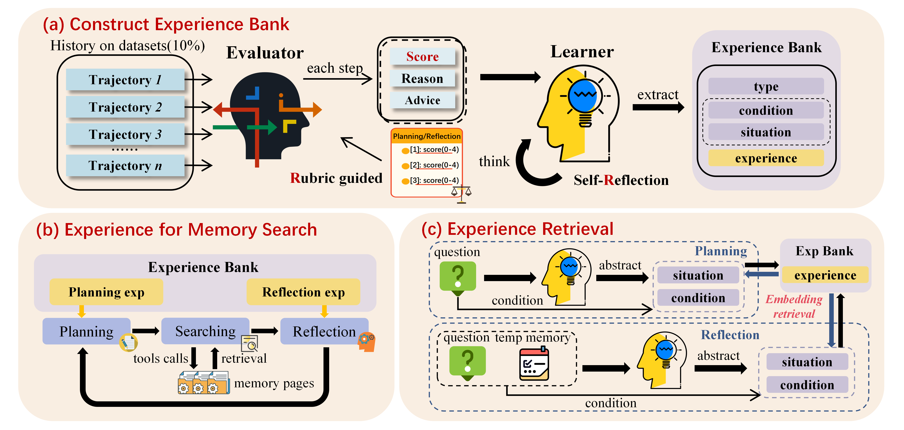

# 🧠 R²-Mem: Reflective Experience for Memory Search
## 📄 Abstract
Deep search has recently emerged as a promising paradigm for enabling agents to retrieve fine-grained historical information without heavy memory pre-managed. However, existing deep search agents for memory system repeat past error behaviors because they fail to learn from the prior high- and low-quality search trajectories. To address this limitation, we propose R²-Mem, a reflective experience framework for memory search systems. In the offline stage, a Rubric-guided Evaluator scores low- and high-quality steps in historical trajectories, and a self-Reflection Learner distills the corresponding abstract experience. During the online inference, the retrieved experience will guide future search actions to avoid repeated mistakes and maintain high-quality behaviors. Extensive experiments demonstrate that R²-Mem consistently improves both effectiveness and efficiency over strong baselines, improving F1 scores by up to 22.6%, while reducing token consumption by 12.9% and search iterations by 20.2%. These results verify that R²-Mem provides a RL-free and low-cost solution for self-improving LLM agents.

code will update later...
The tutorial will be updated later...


## Framework Overview



# Project Structure

```text
R²-Mem/
├── requirements.txt                          # Python dependencies
│
├── scripts/
│   ├── download_data.sh                     # Download datasets
│   ├── eval_hotpotqa.sh                     # ⚙️ run baseline GAM HotpotQA
│   ├── eval_locomo.sh                       # ⚙️ run baseline GAM LoCoMo
│   └── eval_narrativeqa.sh                  # ⚙️ run baseline GAM NarrativeQA
│
├── data/
│   └── locomo/
│       └── locomo10.json                    # 📚 LoCoMo datasets (Other datasets are too large, please download them yourself.)
│
├── gam/                                     # Baseline GAM framework
│   │
│   ├── agents/
│   │   ├── memory_agent.py                  # Memory agent
│   │   └── research_agent.py                # Research agent
│   │
│   ├── retriever/
│   │   ├── bm25.py                          # Sparse BM25 retriever
│   │   ├── dense_retriever.py               # Dense retriever
│   │   └── index_retriever.py               # Retrieval index management
│   │
│   ├── generator/
│   │   ├── openai_generator.py              # OpenAI API backend
│   │   └── vllm_generator.py                # vLLM inference backend
│   │
│   ├── prompts/
│   │   ├── memory_prompts.py                # Memory retrieval prompts
│   │   └── research_prompts.py              # Research prompts
│   │
│   ├── config/
│   │   ├── generator.py                     # Generator configuration
│   │   └── retriever.py                     # Retriever configuration
│   │
│   └── schemas/
│       ├── memory.py
│       ├── page.py
│       ├── result.py
│       └── search.py
│
├── exp/                                     # R²-Mem framework
│   │
│   ├── self_reflection.py                   # Self-reflection and experience generation (✨Learner)
│   ├── judge_model.py                       # Evaluator model (✨Evaluator)
│   ├── evaluate_locomo.py                   # Compare results of R²-Mem and GAM on [LoCoMo]
│   ├── evaluate_hotpotqa_narrativeqa.py     # Compare results of R²-Mem and GAM on [hotpotqa/narrativeqa]
│   │
│   ├── prompts/
│   │   ├── self_reflection_prompts.py       # self-Reflection prompts
│   │   ├── research_prompts_exp.py          # Experience-aware prompts
│   │   └── research_agent_exp.py            # R²-Mem agent prompts
│   │
│   └── eval/
│       ├── locomo.py                        # 😎 run R²-Mem LoCoMo evaluation with experience bank
│       ├── research_agent_exp_main.py       # Main R²-Mem pipeline
│       ├── experience_encoder.py            # Experience retrieval encoder
│       │
│       ├── datasets_test/
│       │   ├── hotpotqa_exp.py              # HotpotQA with experience bank
│       │   └── narrativeqa_exp.py           # NarrativeQA with experience bank
│       │
│       └── exp_scripts/
│           ├── exp_hotpotqa.sh              # 😎 run R²-Mem HotpotQA evaluation script with experience bank
│           └── exp_narrativeqa.sh           # 😎 run R²-Mem NarrativeQA evaluation script with experience bank
│
└── eval/
    ├── hotpotqa_test.py                     # HotpotQA benchmark test
    ├── locomo_test.py                       # LoCoMo benchmark test
    └── narrativeqa_test.py                  # NarrativeQA benchmark test
```


# Environment Setup
## 1. Download Models

Please download the following models and place them in your own local paths:
at least:
- Qwen2.5-7B-Instruct
- BAAI/bge-m3

---

## 2. Install Dependencies

```bash
pip install -r requirements.txt
cd gam
pip install -e ".[all]"
```

---

# Launch vLLM Service
Start the vLLM OpenAI-compatible API server:

```bash
python -m vllm.entrypoints.openai.api_server \
    --model qwen2.5-7B-Instruct \
    --served-model-name qwen2.5-7B-Instruct \
    --trust-remote-code \
    --gpu-memory-utilization 0.85 \
    --max-model-len 32768 \
    --port 8001
```

This launches the learner model backend used in the self-reflection pipeline.

---

# Step 1: Evaluate Baseline GAM

Run the following script to obtain:
(configure the following parameters)
- memory retrieval traces
- baseline GAM performance

```bash
export PYTHONPATH=$(pwd)
bash scripts/eval_locomo.sh
```

---

# Step 2: Run Self-Reflection and Build Experience Bank

Before running self-reflection, configure the following parameters in:

```bash
exp/self_reflection.py
```

## Required Configurations

### Embedding Model

```python
bge_model_path
```

Set this to your local BGE-M3 model path.

---

### Evaluator API

Configure either:

```python
GPT_API_key
```

or

```python
DEEPSEEK_API_key
```

This evaluator API can be any third-party OpenAI-compatible interface.

---

### Learner (vLLM) Parameters

Configure the vLLM-related settings:

```python
base_url
model_name
port
```

---

### Experience Bank Path

```python
expbank_path
```

Set the directory where you want to store the generated experience bank.

---

## Run Self-Reflection

```bash
python exp/self_reflection.py
```

This step will:

- analyze GAM traces
- perform self-reflection
- generate reusable experiences
- build the experience bank

---

# Step 3: Evaluate R²-Mem with Experience Bank

Modify the following file:

```bash
exp/eval/research_agent_exp_main.py and exp/eval/experience_encoder.py
```

## Required Modifications

### Experience Bank Path

```python
exp_bank_path
```

### Model Size

```python
model_size
```

### Experience Encoder 

```python
_MODEL_PATH
```
---

# Step 4: Configure LoCoMo Evaluation

Modify:

```bash
exp/eval/locomo.py
```

## Required Configurations

### R²-Mem Results Path

```python
results_path
```

Path to store R²-Mem evaluation results.

---

### GAM Results Path

```python
GAM_path
```

Path to the previously generated GAM baseline results.

---

## Run LoCoMo Evaluation

```bash
python exp/eval/locomo.py
```

---

# Step 5: Compare R²-Mem and GAM Performance

Run:

```bash
python exp/evaluate_locomo.py
```

This script evaluates and compares:

- baseline GAM
- R²-Mem enhanced agent

on the LoCoMo benchmark.

---

# Overall Pipeline

```text
1. Install dependencies
2. Download models
3. Launch vLLM
4. Run baseline GAM evaluation
5. Run self-reflection to build experience bank
6. Run R²-Mem evaluation
7. Compare R²-Mem and GAM results
```
